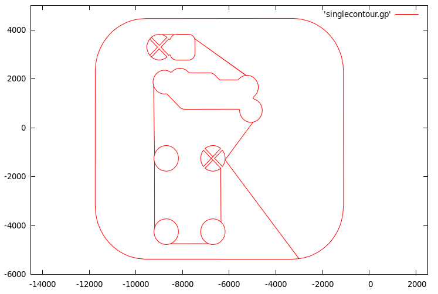

weakpwh
=======

Command line utility to convert a polygon with holes to a contiguous contour that does not 'streak' across any non-filled region.
Though this was intended to be a 
[weakly simple polygon](http://en.wikipedia.org/wiki/Simple_polygon#Weakly_simple_polygon), 
strictly speaking, there is no guarantee that this will be the case.
For example, there could 'bridges' to holes that cross each other.  
The 'bridges' are guaranteed to be in filled regions but might intersect.

To calculate the contiguous boundary, the Delaunay triangulation is calculated using the [poly2tri](https://code.google.com/p/poly2tri/) package and the polygon boundaries are walked using the Delaunay triangles to connect them.

This is mostly a simple wrapper around the [poly2tri](https://code.google.com/p/poly2tri/) package.

To Compile
----------

    g++ -g clipper.cpp sweep/advancing_front.cc sweep/cdt.cc sweep/sweep.cc sweep/sweep_context.cc common/shapes.cc weakpwh.cpp -o weakpwh

Sample Usage
-------------

    cat testdata/test4.gp | ./weakpwh -i -

Example output
--------------

    ./weakpwh -i testdata/realworld.gp -o singlecontour.gp ; echo " plot 'singlecontour.gp' with l " | gnuplot -p

Input Format
------------

Polygons are specified one point per line, two integers per line.  Blank lines denote separate simple polygons.  A polygon with holes is specified with it's outer boundary first, followed by the holes contained within it.  Specifying non strictly simple polygons, self intersecting polygons, holes outside of the boundary, holes that have boundary points or lines colinear with other holes or the boundary are all undefined.

For example, here is a simple polygon with holes:

    # ob
    0 0
    10 0
    10 10
    0 10

    # ho0 
    2 2
    2 6
    4 6
    4 4
    3 4
    3 3
    5 3
    5 2

    # ho1 
    1 7
    1 8
    8 8
    8 7

LICENSE
-------

AGPLv3
